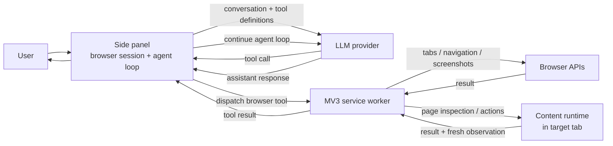

# Architecture

## Runtime

The agent loop lives in the side panel. Each model turn can either produce a browser tool call or finish with an assistant response. Tool results are returned to the same session and become the next model input.

The side panel owns the long-lived session because Manifest V3 service workers are suspendable. The service worker handles browser-level operations and routes page-level work to the content runtime in the targeted tab.

## Page observation

`page_state` is a bounded structural index, not a DOM dump. It includes page metadata, major regions, important controls, scroll surfaces, attention surfaces, busy signals, and explicit coverage counts.

A full baseline is followed by `delta` or `unchanged` observations where possible. Large changes fall back to a fresh full observation.

Search/query tools are independent of the bounded index:

- `page_search` searches text, labels, and attributes across the currently materialized DOM.
- `page_find` applies a native CSS selector with an optional text filter.
- `page_read` expands a relevant element or region.

## Element references

Tools return ephemeral refs such as `T2:e18`.

- `T2` is a stable tab alias for the current chat session.
- `e18` identifies a page element in that tab.
- refs can become stale after navigation or major re-rendering; the agent then searches/observes again.

## Interaction

Model-facing actions are intentionally small:

- `tabs_list`, `tabs_open`, `tabs_focus`, `tabs_close`
- `page_state`, `page_search`, `page_find`, `page_read`
- `click`, `fill`, `select`, `press`, `scroll`, `navigate`
- `wait`
- `page_screenshot`

Normal actions use DOM/content-script interaction. Before clicking/filling/selecting, the runtime checks that the target is rendered, enabled, and not covered by another element.

## Settling

After state-changing actions, the browser session polls page deltas until the page has been quiet briefly. Generic busy signals such as `aria-busy`, progress indicators, or generation controls extend the settling window.

If the page is still busy after the automatic window, the model can call `wait(tab, seconds)` and inspect the returned observation.

## Sessions

A browser session can contain multiple user/assistant messages. Provider conversation continuity and tab aliases remain intact until the user starts **New session**.

Raw tool/model history is held for developer tracing. It is cleared with the session.

## Visual fallback

Structured inspection is the default. `page_screenshot` is available when layout or a visually grounded control cannot be understood from the structural tools alone.
